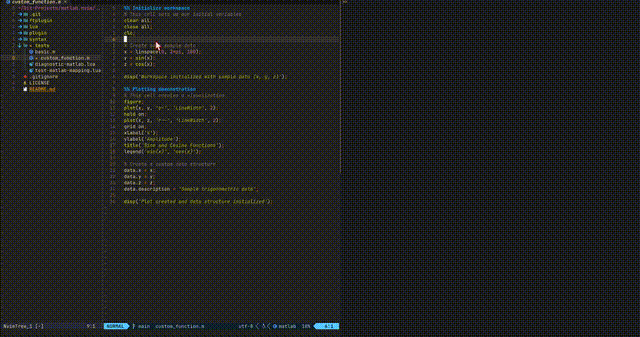

# matlab.nvim

A modern Neovim plugin for MATLAB integration with tmux. This plugin provides integration between Neovim, MATLAB, and tmux, making your MATLAB development workflow more efficient.

This plugin is inspired by [MortenStabenau/matlab-vim](https://github.com/MortenStabenau/matlab-vim) but rewritten in Lua for Neovim with a modular architecture and enhanced functionality.

The plugin is far from complete, but based on some internet search, it seems to be the only MATLAB plugin for Neovim. 
**Contributions are more than welcome.**



## Features

- Launches a MATLAB console in a tmux split
- Run MATLAB scripts directly from Neovim
- Execute MATLAB code cells (sections between %% comments)
- Fold/unfold MATLAB cell sections
- Visual breakpoint indication with customizable appearance
- Set and clear breakpoints interactively
- Access MATLAB documentation
- View MATLAB workspace variables in tmux pane
- Save and load MATLAB workspace files
- Enhanced syntax highlighting with headers
- Space leader key compatibility
- **Full debugging support** with [nvim-dap-ui](https://github.com/rcarriga/nvim-dap-ui) integration
  - Step-through execution (over, into, out)
  - Interactive breakpoints with visual indicators
  - Variable inspection and REPL
  - Call stack visualization

## Requirements

- Neovim 0.7.0 or later
- tmux (must be installed and you must run Neovim inside a tmux session)
- MATLAB
- [nvim-dap-ui](https://github.com/rcarriga/nvim-dap-ui) (for debugging features)

### Tmux Setup

This plugin requires you to run Neovim inside a tmux session. If you're not familiar with tmux, here's a quick start:

1. Install tmux:
   - macOS: `brew install tmux`
   - Ubuntu/Debian: `sudo apt install tmux`
   - CentOS/RHEL: `sudo yum install tmux`

2. Start a tmux session:
   ```sh
   tmux
   ```

3. Inside the tmux session, launch Neovim:
   ```sh
   nvim
   ```

4. Basic tmux commands:
   - Split horizontally: `Ctrl-b "` 
   - Split vertically: `Ctrl-b %`
   - Switch panes: `Ctrl-b arrow-key`
   - Detach session (without closing): `Ctrl-b d`
   - Reattach to session: `tmux attach`

## Installation

### Using [packer.nvim](https://github.com/wbthomason/packer.nvim)

```lua
use {
  'idossha/matlab.nvim',
  config = function()
    require('matlab').setup()
  end
}
```

### Using [lazy.nvim](https://github.com/folke/lazy.nvim) - Recommended

```lua
{
  'idossha/matlab.nvim',
  ft = 'matlab',  -- Lazy-load on MATLAB files
  dependencies = {
    'rcarriga/nvim-dap-ui',
    dependencies = {
      'mfussenegger/nvim-dap',
      'nvim-neotest/nvim-nio'
    }
  },
  config = function()
    require('matlab').setup()
  end
}
```

See **[DEBUGGING.md](DEBUGGING.md)** for complete debugging documentation.

## Configuration

You can customize matlab.nvim by passing options to the setup function:

```lua
require('matlab').setup({
  -- Path to MATLAB executable (should be full path)
  executable = '/path/to/matlab',            
  
  -- Environment variables to set before starting MATLAB
  environment = {
    -- LD_LIBRARY_PATH = '/usr/local/lib:/opt/custom/lib',
    -- MATLAB_LOG_DIR = '/tmp/matlab_logs',
    -- DISPLAY = ':0.0',  -- For X11 forwarding on Linux
  },
  
  -- UI options
  panel_size = 50,                  -- Size of the tmux pane (in percentage)
  panel_size_type = 'percentage',   -- 'percentage' or 'fixed' (fixed = columns)
  tmux_pane_direction = 'right',    -- Position of the tmux pane ('right', 'below')
  tmux_pane_focus = true,           -- Make tmux pane visible when created
  
  -- Behavior options
  auto_start = true,                -- Auto-start MATLAB when opening a .m file
  default_mappings = true,          -- Enable default keymappings
  force_nogui_with_breakpoints = true, -- Prevent MATLAB GUI from opening when breakpoints exist
  
  -- Breakpoint visualization
  breakpoint = {
    sign_text = '■',                -- Character to use for breakpoint sign
    sign_hl = 'MatlabBreakpoint',   -- Highlight group for the sign
    line_hl = 'MatlabBreakpointLine', -- Highlight group for the entire line
    num_hl = 'MatlabBreakpoint',    -- Highlight group for the line number
  },

  -- Debug configuration
  debug = {
    enabled = true,                 -- Enable debugging features
    auto_update_ui = true,          -- Automatically update debug UI indicators
    show_debug_status = true,       -- Show debug status in status line
  },

  -- Debug UI configuration
  debug_ui = {
    variables_position = 'right',   -- Position of variables window ('left', 'right', 'top', 'bottom')
    variables_size = 0.3,           -- Size of variables window (0.0-1.0)
    callstack_position = 'bottom',  -- Position of call stack window
    callstack_size = 0.3,           -- Size of call stack window
    breakpoints_position = 'left',  -- Position of breakpoints window
    breakpoints_size = 0.25,        -- Size of breakpoints window
    repl_position = 'bottom',       -- Position of REPL window
    repl_size = 0.4,                -- Size of REPL window
  },

  -- Notification options
  minimal_notifications = false,    -- Only show important notifications
  debug = false,                    -- Enable debug logging
  
  -- Keymap customization
  mappings = {
    prefix = '<Leader>m',           -- Common prefix for all MATLAB mappings
    run = 'r',                      -- Run MATLAB script
    run_cell = 'c',                 -- Run current MATLAB cell
    run_to_cell = 't',              -- Run to current MATLAB cell
    breakpoint = 'b',               -- Set breakpoint at current line
    clear_breakpoint = 'd',         -- Clear breakpoint in current file
    clear_breakpoints = 'D',        -- Clear all breakpoints
    doc = 'h',                      -- Show documentation for word under cursor
    toggle_workspace = 'w',         -- Show MATLAB workspace in tmux pane (whos)
    clear_workspace = 'x',          -- Clear MATLAB workspace
    save_workspace = 's',           -- Save MATLAB workspace
    load_workspace = 'l',           -- Load MATLAB workspace
    toggle_cell_fold = 'f',         -- Toggle current cell fold
    toggle_all_cell_folds = 'F',    -- Toggle all cell folds
    open_in_gui = 'g',             -- Open current script in MATLAB GUI
  }
})
```

### Environment Variables

The plugin supports setting environment variables that will be applied before starting MATLAB. This is particularly useful for:

- **Library paths**: Setting `LD_LIBRARY_PATH` on Linux for custom libraries
- **Display settings**: Configuring `DISPLAY` for X11 forwarding
- **MATLAB-specific variables**: Custom MATLAB environment configuration
- **System dependencies**: Fixing package conflicts on Linux distributions

#### Example Usage

```lua
require('matlab').setup({
  executable = '/usr/local/MATLAB/R2024a/bin/matlab',
  environment = {
    LD_LIBRARY_PATH = '/usr/local/lib:/opt/custom/lib',
    MATLAB_LOG_DIR = '/tmp/matlab_logs',
    DISPLAY = ':0.0',  -- For X11 forwarding
    -- Add any other environment variables you need
  },
})
```

#### Common Use Cases

**Linux with package conflicts** (like the user's Arch Linux issue):
```lua
environment = {
  LD_LIBRARY_PATH = '/usr/local/lib:/opt/matlab/lib',
  XAPPLRESDIR = '/opt/matlab/X11/app-defaults',
}
```

**Remote server with X11 forwarding**:
```lua
environment = {
  DISPLAY = 'localhost:10.0',
  XAUTHORITY = os.getenv('HOME') .. '/.Xauthority',
}
```

**Debug mode**:
```lua
environment = {
  MATLAB_LOG_DIR = '/tmp/matlab_debug',
  MATLAB_PREFDIR = '/tmp/matlab_prefs',
}
```

**Note**: Environment variable names must be valid (letters, numbers, and underscores only). Invalid names will be ignored with a warning.

### MATLAB Executable Detection

The plugin will automatically attempt to find your MATLAB installation by searching common installation paths based on your operating system. If found, it will use that installation for the current session and suggest updating your configuration.

The automatic detection searches for recent MATLAB versions (up to 5 years back) in standard installation directories.

However, if you're getting the error "Something went wrong starting the MATLAB server", it's best to explicitly specify the full path to your MATLAB executable:

**For macOS:**
```lua
require('matlab').setup({
  executable = '/Applications/MATLAB_R2024a.app/bin/matlab',  -- Adjust according to your version
  -- other options...
})
```

**For Linux:**
```lua
require('matlab').setup({
  executable = '/usr/local/MATLAB/R2024a/bin/matlab',  -- Adjust according to your installation
  -- other options...
})
```

**For WSL (Windows Subsystem for Linux):**
```lua
require('matlab').setup({
  executable = '/usr/local/MATLAB/R2024a/bin/matlab',  -- Adjust according to your installation
  -- Note: DISPLAY is automatically unset to prevent GUI from opening
  -- If you need X11 forwarding, explicitly set DISPLAY in environment:
  -- environment = {
  --   DISPLAY = ':0',
  -- },
})
```

**For Windows:**
```lua
require('matlab').setup({
  executable = 'C:\\Program Files\\MATLAB\\R2024a\\bin\\matlab.exe',  -- Adjust according to your installation
  -- other options...
})
```

#### Finding Your MATLAB Path

If you're not sure where MATLAB is installed:

**macOS**:
1. Open Finder
2. Navigate to Applications folder
3. Look for "MATLAB_R####x.app" (where #### is the year and x is a or b)
4. The executable is located at `/Applications/MATLAB_R####x.app/bin/matlab`

**Linux**:
1. Run `which matlab` in your terminal to see if it's in your PATH
2. Common installation directories include:
   - `/usr/local/MATLAB/R####x/bin/matlab`
   - `/opt/MATLAB/R####x/bin/matlab`
   - `~/MATLAB/R####x/bin/matlab`

**Windows**:
1. Check Program Files folder: `C:\Program Files\MATLAB\R####x\bin\matlab.exe`
2. Or for 32-bit MATLAB on 64-bit Windows: `C:\Program Files (x86)\MATLAB\R####x\bin\matlab.exe`


### Common Tasks

- **Running Code**: 
  - Open any MATLAB file (.m) with Neovim inside tmux
  - Use `<Leader>mr` or `:MatlabRun` to execute the current file
  - Use `<Leader>mc` or `:MatlabRunCell` to execute the current cell (code section between %% markers)
  - Use `<Leader>mt` or `:MatlabRunToCell` to execute all code from the beginning to the current cell

- **Working with Cells**:
  - MATLAB cells are sections of code separated by `%%` comment lines
  - Use `<Leader>mf` to fold/unfold the current cell
  - Use `<Leader>mF` to fold/unfold all cells
  - Use `<Leader>mc` or `:MatlabRunCell` to execute only the current cell

- **Debugging**:
  - Use `<Leader>mb` or `:MatlabBreakpoint` to set a breakpoint at the current line (with visual indicator)
  - Use `<Leader>md` or `:MatlabClearBreakpoint` to clear a breakpoint in the current file
  - Use `<Leader>mD` or `:MatlabClearBreakpoints` to clear all breakpoints
  - Run your code with `<Leader>mr` or `:MatlabRun` to hit the breakpoints
  - By default, MATLAB GUI won't open even when breakpoints are present (`force_nogui_with_breakpoints` option)
  - Use `<Leader>mg` or `:MatlabOpenInGUI` if you want to open the current script in MATLAB GUI

- **Documentation**:
  - Place cursor on any MATLAB function
  - Use `<Leader>mh` or `:MatlabDoc` to display documentation for it

- **Workspace Management**:
  - Use `<Leader>mw` or `:MatlabWorkspace` to show workspace variables (uses `whos` command)
  - Use `<Leader>mx` or `:MatlabClearWorkspace` to clear all variables
  - Use `<Leader>ms` or `:MatlabSaveWorkspace` to save your MATLAB workspace to a .mat file
  - Use `<Leader>ml` or `:MatlabLoadWorkspace` to load a saved workspace from a .mat file

- **UI & Customization**:
  - Use `:MatlabDebugUI` to check your current UI settings
  - Control notification verbosity with the `minimal_notifications` option
  - Customize tmux pane size and position with `panel_size` and `tmux_pane_direction`

- **Debugging MATLAB Code**:
  - Start debugging session: `<Leader>mds` or `:MatlabDebugStart`
  - Stop debugging: `<Leader>mde` or `:MatlabDebugStop`
  - Continue execution: `<Leader>mdc` or `:MatlabDebugContinue`
  - Step over: `<Leader>mdo` or `:MatlabDebugStepOver`
  - Step into: `<Leader>mdi` or `:MatlabDebugStepInto`
  - Step out: `<Leader>mdt` or `:MatlabDebugStepOut`
  - Toggle breakpoint: `<Leader>mdb` or `:MatlabDebugToggleBreakpoint`
  - Clear all breakpoints: `<Leader>mdd` or `:MatlabDebugClearBreakpoints`
  - Show debug UI: `<Leader>mdu` or `:MatlabDebugUI`

- **Customizing Keymappings**:
  - Full support for Space as leader key with proper handling of key conflicts
  - You can customize all keymappings through the `mappings` table in your setup
  - Use the `prefix` option to change the common prefix for all mappings
  - Example: To use comma as a prefix and change the run key to 'e':
    ```lua
    require('matlab').setup({
      mappings = {
        prefix = ',',  -- Use comma as prefix
        run = 'e',     -- Run script with ,e
        -- other mappings remain default...
      }
    })
    ```

## Default Keymappings

When `default_mappings` is enabled, the following keymaps are available in MATLAB files. All mappings start with `<Leader>m` followed by a second key:

| Mapping      | Command                  | Description                            |
|--------------|--------------------------|----------------------------------------|
| `<Leader>mr` | `:MatlabRun`             | Run current MATLAB script              |
| `<Leader>mc` | `:MatlabRunCell`         | Run current MATLAB cell                |
| `<Leader>mt` | `:MatlabRunToCell`       | Run up to current MATLAB cell          |
| `<Leader>mb` | `:MatlabBreakpoint`      | Set breakpoint at current line         |
| `<Leader>md` | `:MatlabClearBreakpoint` | Clear breakpoint in current file       |
| `<Leader>mD` | `:MatlabClearBreakpoints`| Clear all breakpoints                  |
| `<Leader>mh` | `:MatlabDoc`             | Show documentation for word under cursor |
| `<Leader>mw` | `:MatlabWorkspace`       | Show workspace variables (whos)        |
| `<Leader>mx` | `:MatlabClearWorkspace`  | Clear MATLAB workspace                 |
| `<Leader>ms` | `:MatlabSaveWorkspace`   | Save MATLAB workspace to .mat file     |
| `<Leader>ml` | `:MatlabLoadWorkspace`   | Load MATLAB workspace from .mat file   |
| `<Leader>mf` | `:MatlabToggleCellFold`  | Toggle current cell fold               |
| `<Leader>mF` | `:MatlabToggleAllCellFolds` | Toggle all cell folds               |
| `<Leader>mg` | `:MatlabOpenInGUI`        | Open current script in MATLAB GUI     |
| `<Leader>mds`| `:MatlabDebugStart`        | Start MATLAB debugging session        |
| `<Leader>mde`| `:MatlabDebugStop`         | Stop MATLAB debugging session         |
| `<Leader>mdc`| `:MatlabDebugContinue`     | Continue MATLAB debugging             |
| `<Leader>mdo`| `:MatlabDebugStepOver`     | Step over in MATLAB debugging         |
| `<Leader>mdi`| `:MatlabDebugStepInto`     | Step into in MATLAB debugging         |
| `<Leader>mdt`| `:MatlabDebugStepOut`      | Step out in MATLAB debugging          |
| `<Leader>mdb`| `:MatlabDebugToggleBreakpoint` | Toggle breakpoint in MATLAB debugging |
| `<Leader>mdd`| `:MatlabDebugClearBreakpoints` | Clear all breakpoints in MATLAB debugging |
| `<Leader>mdu`| `:MatlabDebugUI`           | Show MATLAB debug UI                 |
| `<Leader>mdv`| `:MatlabDebugShowVariables` | Show variables window                |
| `<Leader>mdk`| `:MatlabDebugShowCallstack` | Show call stack window               |
| `<Leader>mdp`| `:MatlabDebugShowBreakpoints`| Show breakpoints window              |
| `<Leader>mdr`| `:MatlabDebugShowRepl`      | Show REPL window                     |
| `<Leader>mtv`| `:MatlabDebugToggleVariables`| Toggle variables window              |
| `<Leader>mtk`| `:MatlabDebugToggleCallstack`| Toggle call stack window             |
| `<Leader>mtp`| `:MatlabDebugToggleBreakpoints`| Toggle breakpoints window            |
| `<Leader>mtr`| `:MatlabDebugToggleRepl`    | Toggle REPL window                   |
| `<Leader>mdx`| `:MatlabDebugCloseUI`       | Close all debug UI windows           |

## Debugging MATLAB Code

matlab.nvim now includes full debugging support using MATLAB's built-in debugging commands. This allows you to step through your code, set breakpoints, inspect variables, and control execution flow directly from Neovim.

### Quick Start

1. Open a MATLAB file (`.m`) in Neovim inside a tmux session
2. Start MATLAB with `:MatlabStartServer`
3. Set breakpoints with `<Leader>mdb` or `:MatlabDebugToggleBreakpoint`
4. Start debugging with `<Leader>mds` or `:MatlabDebugStart`
5. Use stepping commands to navigate through your code:
   - `<Leader>mdc` - Continue execution
   - `<Leader>mdo` - Step over
   - `<Leader>mdi` - Step into functions
   - `<Leader>mdt` - Step out of functions
6. Open the debug UI with `<Leader>mdu` to see variables, call stack, and breakpoints
7. Use the REPL window to execute MATLAB commands during debugging
8. Stop debugging with `<Leader>mde` or `:MatlabDebugStop`

### Debugging Commands

#### Core Debugging Commands

| Command | Description |
|---------|-------------|
| `:MatlabDebugStart` | Start a debugging session for the current file |
| `:MatlabDebugStop` | Stop the current debugging session |
| `:MatlabDebugContinue` | Continue execution until next breakpoint |
| `:MatlabDebugStepOver` | Execute current line and stop at next line |
| `:MatlabDebugStepInto` | Step into function calls |
| `:MatlabDebugStepOut` | Step out of current function |
| `:MatlabDebugToggleBreakpoint` | Toggle breakpoint at current line |
| `:MatlabDebugClearBreakpoints` | Clear all breakpoints |

#### Debug UI Commands

| Command | Description |
|---------|-------------|
| `:MatlabDebugUI` | Show all debugging windows (variables, call stack, breakpoints, REPL) |
| `:MatlabDebugShowVariables` | Show variables window |
| `:MatlabDebugShowCallstack` | Show call stack window |
| `:MatlabDebugShowBreakpoints` | Show breakpoints window |
| `:MatlabDebugShowRepl` | Show MATLAB REPL/console window |
| `:MatlabDebugToggleVariables` | Toggle variables window |
| `:MatlabDebugToggleCallstack` | Toggle call stack window |
| `:MatlabDebugToggleBreakpoints` | Toggle breakpoints window |
| `:MatlabDebugToggleRepl` | Toggle REPL window |
| `:MatlabDebugCloseUI` | Close all debug UI windows |

### Visual Indicators

- **Breakpoints**: Red square (■) in the sign column
- **Current execution line**: Green arrow (▶) when debugging is active

### Debug UI Windows

The debugging UI provides several floating windows (similar to nvim-dap-ui):

- **Variables Window** (`<Leader>mdv`): Shows MATLAB workspace variables
- **Call Stack Window** (`<Leader>mdk`): Shows the current execution stack
- **Breakpoints Window** (`<Leader>mdp`): Lists all active breakpoints
- **REPL Window** (`<Leader>mdr`): Interactive MATLAB console for debugging

Each window can be toggled individually or all can be opened with `<Leader>mdu`. Press `q` or `<Esc>` to close individual windows, or use `<Leader>mdx` to close all debug UI windows.

### Tips

- Always save your file (`:w`) before starting debugging
- Use `<Leader>mdu` to inspect variables and call stack during debugging
- MATLAB's debugging commands work in the tmux pane - you can also type them directly
- Breakpoints persist across debugging sessions within the same Neovim session

### Requirements

- MATLAB must be running in the tmux pane
- Files must be saved before debugging
- Works with MATLAB's command-line debugger (not GUI debugger)

## Troubleshooting

### MATLAB Opens in GUI Mode Instead of CLI (WSL/Linux)

**Problem**: MATLAB opens a GUI window instead of running in the tmux pane (common on WSL and Linux with X11).

**Solution**: The plugin now automatically unsets `DISPLAY` on Linux/WSL to force CLI mode. If you still have issues:

1. Make sure you're using the latest version of the plugin
2. Enable debug mode to see what's happening:
   ```lua
   require('matlab').setup({
     debug = true,
   })
   ```
3. Check the log file: `~/.cache/nvim/matlab_nvim.log`
4. Try running MATLAB manually to verify: `/path/to/matlab -nodesktop -nosplash`

**If you need GUI/X11 forwarding**, you can explicitly set DISPLAY:
```lua
require('matlab').setup({
  environment = {
    DISPLAY = ':0',  -- or your X server address
  },
})
```

**Note**: The DISPLAY unset only affects the MATLAB instance running in the tmux pane. The `:MatlabOpenInGUI` command spawns a separate MATLAB process that will still have access to your display and open normally.

### "MATLAB pane could not be found" Error

**Problem**: Plugin shows this error when trying to run MATLAB commands.

**Causes**:
1. MATLAB failed to start in the tmux pane
2. The pane was created but MATLAB didn't launch properly
3. You're not inside a tmux session

**Solutions**:
- Make sure you're running Neovim inside tmux: `tmux` then `nvim`
- Check the MATLAB executable path is correct
- Enable debug mode and check the log file
- Try `:MatlabStartServer` manually and watch for errors

### Environment Variable Issues

**Problem**: MATLAB fails to start due to library conflicts or missing environment variables (common on Arch Linux and other distributions).

**Solution**: Use the `environment` configuration option instead of trying to set variables in the executable path:

```lua
-- ❌ This WON'T work:
require('matlab').setup({
  executable = "export LD_LIBRARY_PATH=/custom/path; /usr/local/MATLAB/R2024a/bin/matlab"
})

-- ✅ This WILL work:
require('matlab').setup({
  executable = '/usr/local/MATLAB/R2024a/bin/matlab',
  environment = {
    LD_LIBRARY_PATH = '/custom/path',
    XAPPLRESDIR = '/opt/matlab/X11/app-defaults',
  }
})
```

**Why**: The plugin constructs the command internally and needs to properly handle environment variables to ensure they're set before MATLAB starts.

### MATLAB Pane Management

**Problem**: Plugin always creates new tmux panes instead of reusing existing ones.

**Explanation**: This is intentional behavior. The plugin creates a dedicated tmux pane for each MATLAB session to ensure clean state management and avoid conflicts between different MATLAB instances.

### Debug Information

Use `:MatlabDebugUI` to check your current configuration, including environment variables. Enable debug logging for detailed information:

```lua
require('matlab').setup({
  debug = true,
  -- ... other options
})
```

Debug logs are saved to: `~/.cache/nvim/matlab_nvim.log`

## License

MIT
