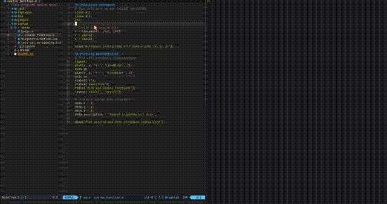

**matlab.nvim** is a modern Neovim plugin for MATLAB integration with tmux.

**Contributions are welcome!** See [CONTRIBUTIONS.md](CONTRIBUTIONS.md).

Project docs: [architecture](docs/ARCHITECTURE.md), [decisions](docs/DECISIONS.md),
[testing](docs/TESTING.md), [roadmap](docs/ROADMAP.md), and [release checks](docs/RELEASING.md).



## Features

- Launch MATLAB console in a tmux split
- Run MATLAB scripts and cells directly from Neovim
- Fold/unfold MATLAB cell sections
- Access MATLAB documentation for functions
- Save and load MATLAB workspace files
- Native MATLAB debugger integration
- Visual breakpoint indicators
- Step-through execution (over, into, out)
- Debug sidebar with variables, call stack, breakpoints

## Requirements

- **Neovim**: 0.9.0 or later
- **tmux**: Must be installed and running
- **MATLAB**: Any recent version

## Installation

### Using [lazy.nvim](https://github.com/folke/lazy.nvim)

```lua
{
  'idossha/matlab.nvim',
  ft = 'matlab',
  config = function()
    require('matlab').setup()
  end
}
```

### Using [packer.nvim](https://github.com/wbthomason/packer.nvim)

```lua
use {
  'idossha/matlab.nvim',
  config = function()
    require('matlab').setup()
  end
}
```

## Configuration

```lua
require('matlab').setup({
  -- MATLAB executable path (auto-detected if in PATH)
  executable = 'matlab',

  -- Tmux pane configuration
  panel_size = 50, -- Example override; see lua/matlab/config.lua for defaults
  panel_size_type = 'percentage',
  tmux_pane_direction = 'right',
  tmux_pane_focus = true,

  -- Behavior
  auto_start = true,
  suppress_editor_on_breakpoint = true,
  default_mappings = true,
  minimal_notifications = true,

  -- Environment variables (useful for Linux)
  environment = {
    -- LD_LIBRARY_PATH = '/usr/local/lib',
    -- DISPLAY = ':0',
  },

  -- Debug logging
  debug = false,
})
```

## Usage

All mappings use `<Leader>m` prefix. Run `:MatlabKeymaps` to see all mappings.

### Basic Operations

| Key | Command | Description |
|-----|---------|-------------|
| `<Leader>mr` | `:MatlabRun` | Run current script |
| `<Leader>mc` | `:MatlabRunCell` | Run current cell |
| `<Leader>mC` | `:MatlabRunToCell` | Run from start to current cell |
| `<Leader>mh` | `:MatlabDoc` | Show documentation |
| `<Leader>mg` | `:MatlabOpenInGUI` | Open in MATLAB GUI |

### Workspace Management

| Key | Command | Description |
|-----|---------|-------------|
| `<Leader>mw` | `:MatlabWorkspace` | Show workspace variables |
| `<Leader>mx` | `:MatlabClearWorkspace` | Clear workspace |

### Code Folding

| Key | Command | Description |
|-----|---------|-------------|
| `<Leader>mf` | `:MatlabToggleCellFold` | Toggle current cell fold |

### Working with Cells

MATLAB cells are code sections separated by `%%` comments:

```matlab
%% Cell 1: Setup
x = 1:10;

%% Cell 2: Processing
y = x.^2;

%% Cell 3: Plotting
plot(x, y);
```

## Debugging

See [Debugging](docs/DEBUGGING.md) for the breakpoint workflow, editor suppression
while retaining plots, commands, sidebar controls, and limitations.

## Troubleshooting

### "MATLAB pane could not be found"

- Ensure running in tmux: `tmux` then `nvim`
- Verify executable path in config
- Try `:MatlabStartServer` manually

### Debugging Issues

**Breakpoint not stopping:**
- Ensure line has executable code (not comments/blank lines)
- File must be saved (`:w`)

### Debug Mode

Enable detailed logging:

```lua
require('matlab').setup({
  debug = true,
})
```

Check configuration: `:MatlabShowConfig`
View logs: `~/.cache/nvim/matlab_nvim.log`  

Inspired by [MortenStabenau/matlab-vim](https://github.com/MortenStabenau/matlab-vim), rewritten in Lua for Neovim.

## License

Inspired by [MortenStabenau/matlab-vim](https://github.com/MortenStabenau/matlab-vim), rewritten in Lua for Neovim.

MIT
